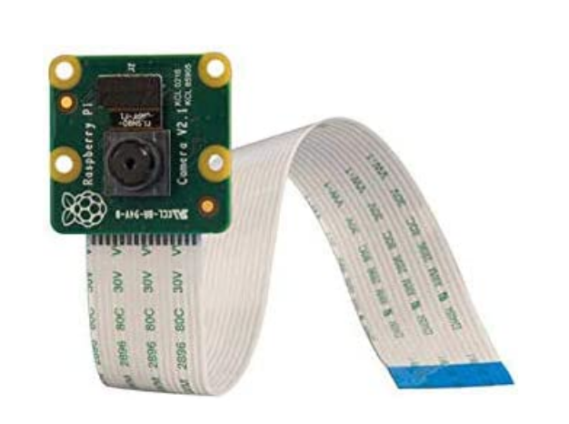
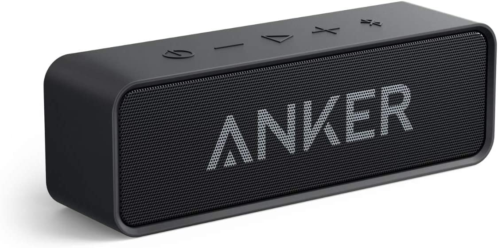

# README

# Paper Piano


## Social Media

https://twitter.com/PaperPiano

## Project Overview

This project aims to develop a real-time piano key recognition and audio output system based on Raspberry Pi. The camera captures and recognizes the keys printed on the paper, and when a key action is detected, the corresponding audio will be played in real time. This system uses computer vision and image processing technology to realize piano key recognition and key detection in various scenarios.

More specific doxgen documents can be found in rasPi forder or show folder. Those 2 version of codes have same function but differenr step to use it on RaspberryPi.

## Social media

[https://twitter.com/PaperPiano](https://twitter.com/PaperPiano)

## Members

Dong Zhao(2818441Z)

Zhao will oversee the encapsulation aspect of the Paper Piano project. This involves wrapping up the code in a way that it becomes easy to use and manage, while also protecting it from interference from other parts of the program. Zhao's role is essential in ensuring that the final product is robust, maintainable, and user-friendly.

Han Zhang(2755881Z)

Zhang will be in charge of all testing procedures for the Paper Piano project. This includes initial testing, ongoing testing throughout the development process, and final testing before project completion. Zhang's role is crucial in ensuring that the Paper Piano functions correctly and meets all specified requirements.

Zheng Chen(2706870C)(quit)

FangZhou Liu(2751741L)(quit)


## Features

### 1) Real-time Recognition and Storage of Initial Piano Key Coordinates:

The system features real-time recognition of piano key coordinates. By utilizing advanced image processing techniques, our program can identify and track the position of piano keys in real-time. The coordinates of each key are stored in the system's memory, providing a reference for future key press detection. This feature plays a crucial role in the system's capability to respond quickly and accurately to the user's interactions.

### 2) Customizable Pattern Recognition:

Our program not only offers predefined patterns for recognition, but also allows users to design and input their own patterns. This provides flexibility in the types of inputs the system can recognize and respond to. As long as the pattern forms a clear rectangular shape, our system can identify it and store the pattern for future use. This feature enhances the user experience by allowing for customization and personalization of the system's response.

### 3) Key Press Detection with Corresponding Audio Output:

One of the core features of the system is its ability to detect key presses and play corresponding audio in response. Once a key press is detected, the system will immediately play the corresponding note or sound. This feature creates a more interactive and dynamic user experience, providing immediate auditory feedback that corresponds to the user's actions. This not only makes the system more enjoyable to use, but also aids in learning and development for users practicing piano.

These features work together to create a robust and interactive system capable of recognizing and responding to user input in real-time. Whether you're practicing piano or experimenting with new patterns and sounds, our program offers a unique and engaging user experience.

## Hardware

### 1) Raspberry Pi

Raspberry Pi is a series of small single-board computers (SBCs).

<div align="left">

</div>

Raspberry Pi can be used for real-time embedded programming as it has the capability to handle real-time applications with its powerful processor and various I/O ports.

**Function of Raspberry Pi for Real-time Embedded Programming:**

- **Control:** Raspberry Pi can be used to control various electronic devices and systems, including robotics, automation, and IoT devices.

- **Data processing:** Raspberry Pi can acquire, process and analyze data in real-time, making it useful for applications that require real-time data processing. With its Input/Output ports, it can interface with a wide range of sensors and actuators, enabling the collection of data and control of hardware in real-time.

- **Programming languages:** Raspberry Pi can be used to develop and test real-time applications using a variety of programming languages, including Python, C, and C++. In this project the main language utilized is C++.

- **Communication:** Raspberry Pi can be used to communicate with other devices and systems. In this project we communicate with GNSS module and camera module.

**I/O ports of Raspberry Pi:**

I/O ports can be interface with external devices and sensors. These ports can be used for various real-time applications, such as robotics, automation, and control systems.

- **UART.** Universal Asynchronous Receiver-Transmitter; In this project, we utilize UART to communicate with GNSS module.
- **GPIO.** General Purpose Input/Output;
- **SPI.** Serial Peripheral Interface;
- **I2C.** Inter-Integrated Circuit.

**Value of Raspberry Pi:**

Raspberry Pi can be an effective solution for real-time embedded programming, and it requires proper configuration and software development skills to ensure the system operates in real-time with the required accuracy and precision.

### 2) Pi Camera



Raspberry Pi v2.1 8 MP 1080p Camera Module

Memory storage capacity: 12 GB

Wireless Type:	Infrared

Second Generation Raspberry Pi Camera Module with Fixed Focus Lens

Sony Exmor IMX219 Sensor Capable of 4K30 1080P60 720P180 8MP Still

3280 (H) x 2464 (V) Active Pixel Count

Maximum of 1080P30 and 8MP Stills in Raspberry Pi Board

More information: [Amazon](https://www.amazon.co.uk/Raspberry-Pi-1080p-Camera-Module/dp/B01ER2SKFS)

### 3) Speaker or headphones



Speaker or headphones are used as audio output devices which can be connected to Raspberry Pi’s 3.5mm jack or HDMI output.

**Speaker or Headphones for Raspberry Pi:**

The Raspberry Pi features a 3.5mm audio jack which provides audio out to speakers or headphones. Besides this, audio can also be played through an HDMI-connected display device if the device supports audio output.

**Function of Speaker or Headphones with Raspberry Pi:**

- **Audio output:** The main function of a speaker or headphones when connected to a Raspberry Pi is to output audio. This can be useful in a variety of applications, including music players, home automation systems, multimedia projects, and more.

- **Alerts and notifications:** In certain applications, the speaker or headphones can be used to provide audible alerts or notifications. For instance, in a home security system, the speaker might output an alarm sound when an intruder is detected.

- **Voice commands:** In conjunction with a microphone, a speaker can be used in voice-controlled applications. For instance, it can provide auditory feedback to the user in response to voice commands.

**Audio Ports of Raspberry Pi:**

The Raspberry Pi supports two types of audio output ports:

- **3.5mm jack:** This is a conventional audio output port that can be used with most headphones and speakers. It supports stereo audio output.
- **HDMI:** The HDMI port on a Raspberry Pi can output both video and audio. If the display device connected via HDMI supports audio, the Raspberry Pi can send audio through the HDMI connection.

**Value of Speaker or Headphones:**

Connecting a speaker or headphones to a Raspberry Pi can enhance the functionality of the device by enabling it to output sound. This can be useful in a wide variety of projects, from simple music players to complex home automation systems. Please ensure that the audio device you are using is compatible with the Raspberry Pi and that the correct drivers are installed if necessary.


## Software Requirements

1. Raspberry Pi OS. Also can build in other Linux environments or windows visual studio
2. OpenCV library
3. mplayer(Raspberry Pi OS).

## How to Build

1. Update your Pi first.
    
    ```bash
    sudo apt update
    sudo apt upgrade
    sudo apt install vim gcc g++ git make
    ```
    
2. Clone the repository:
    
    ```
    git clone https://github.com/Moon-Touched/Paper-Piano.git
    ```

3. Install develop libraries:

   ```
   sudo apt install qt5-default qtbase5-dev qtdeclarative5-dev qtquickcontrols2-5-dev libqt5serialport5-dev libopencv-dev libgtest-dev
   ```


4. Navigate to the folder and run the codes below. A executable file named ‘cvKey’ will be generated in the build folder.
    
    ```bash
    mkdir build
    cd build
    cmake ../
    make
    ```

 5. Run
    ```
    sudo ./PaperPiano
    ```


## Future Improvements

### 1) Improved Audio File Playback:

Currently, the process for playing audio files could be further optimized. In the future, we aim to develop a more efficient way of handling audio playback. One potential solution could involve integrating an audio player like mplayer directly into the codebase, enabling the software to handle audio file operations more seamlessly. This enhancement would eliminate the need for manual intervention in the audio playback process and could significantly improve the user experience by making the system more responsive and easier to use.

### 2) Expanded Instrument Support:

In its current state, the software primarily supports a single-row keyboard structure. However, real pianos often have a more complex structure, with keys distributed over two rows. In future versions, we plan to expand our pattern recognition and audio mapping capabilities to account for this complexity. This will involve modifying our image processing and pattern recognition algorithms to accurately map the positions of keys on a two-row keyboard. Additionally, we aim to add support for other types of keyboard instruments, broadening the range of instruments that users can interact with using our software.

These enhancements will greatly improve the functionality and versatility of the software, providing a more realistic and enriching user experience. By constantly updating and improving our product, we hope to continue meeting and exceeding user needs and expectations. 

## An example of hand detection is as follows ：

- developing demo example： https://user-images.githubusercontent.com/103563340/232533313-ad513ca6-4c4b-4f53-844a-a986e2bf0c66.mp4
